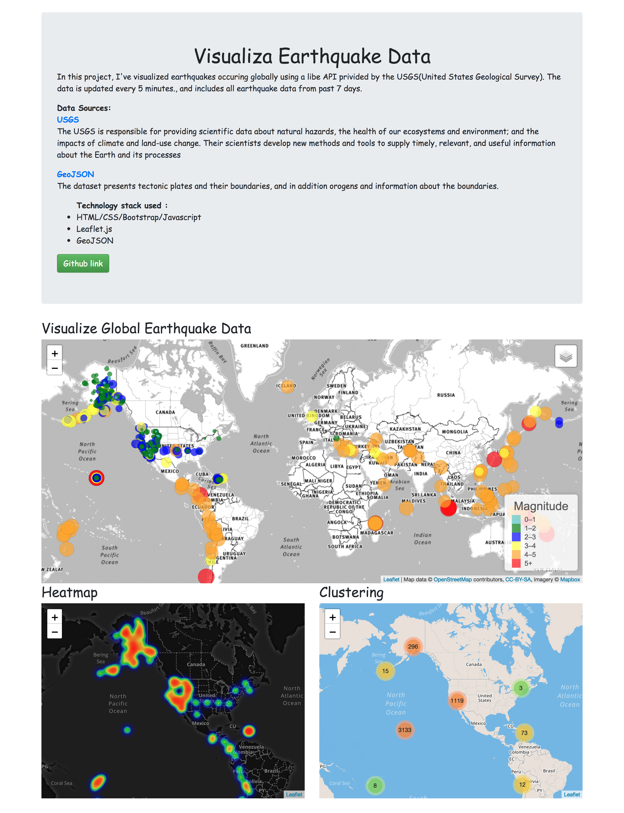

<h1 align="center"> Visualizing Earthquake Data with Leaflet</h1> 

 You can click <a href="https://yycyjqc.github.io/Visualizing_Earthquake_Data_with_Leaflet/">here</a> to access the web application.

  <a href="#background">Background</a> •
  <a href="#data-sources">Data Sources</a> •
  <a href="#technology-stack-used">Technology Stack Used</a> •
  <a href="#user-interface">User Interface</a>

## Background
In this project, I've visualized earthquakes occuring globally using a libe API privided by the USGS(United States Geological Survey). The data is updated every 5 minutes., and includes all earthquake data from past 7 days.

## Data Sources
<dl>
    <dt><a href="https://earthquake.usgs.gov/earthquakes/feed/v1.0/geojson.php">USGS</a></dt>
    <dd>The USGS is responsible for providing scientific data about natural hazards, the health of our ecosystems and environment; and the impacts of climate and land-use change. Their scientists develop new methods and tools to supply timely, relevant, and useful information about the Earth and its processes</dd>
</dl>

<dl>
    <dt><a href="https://raw.githubusercontent.com/fraxen/tectonicplates/master/GeoJSON/PB2002_boundaries.json">GeoJSON</a></dt>
    <dd>The dataset presents tectonic plates and their boundaries, and in addition orogens and information about the boundaries. </dd>
</dl>

## Technology stack used
<ul>
    <li>HTML/CSS/Bootstrap/Javascript</li>
    <li>Leaflet.js</li>
    <li>GeoJSON</li>
</ul>

## User Interface

